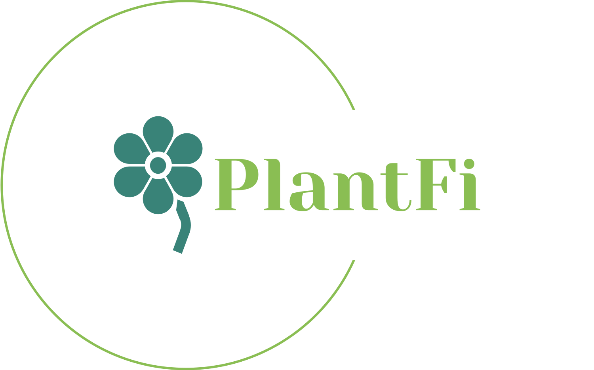

# PlantFI
Has it often happened to you that someone gives you a plant or you see a plant on the internet that you like, but you don't know its name or species? Well, thanks to our website, you can get rid of these inconveniences very easily. With just an image from your computer, you can find out what plant it is, so you can learn about the care it needs and keep it healthy for a long time.

# Development
For the development of our website, we used Django, as our site is built with Python due to the ease it offers for creating the site and connecting the AI. Additionally, the HTML templates also include JavaScript programming for all the animations on our website, ensuring it looks as good as possible.

# Data set: PlantNet-300K

For the AI, we used the PlantNet-300k dataset, which includes data on over 300,000 plant species.

# Model: PyTorch
We developed the model using the PyTorch library in Python, as this was the tool we used to train our model. The model we trained was ResNet18, and training it on the same laptop was very slow, taking 6 days, but in the end, we managed to obtain the best weights for the model to make predictions in the best possible way. Although the model is not 100% accurate, it helps provide assistance that we didn't have before. The model has an accuracy of 86%, and it would be necessary to have more images and processing power to improve these numbers.

# Application:
**Demostrative video:** [https://youtu.be/6eZ5MRNjNoU](https://youtu.be/WnA4fIpaWWc)
